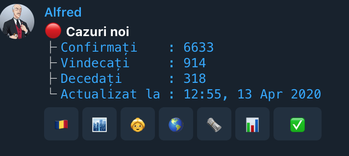
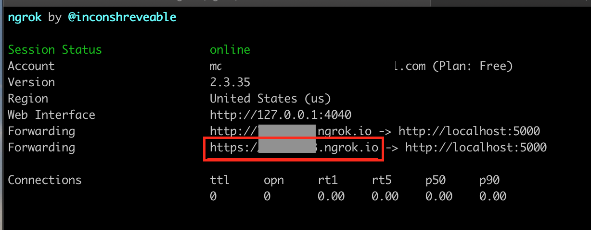

<h1 align="center">Welcome to telegrambot 👋</h1>
<p>
  
  <a href="https://github.com/andreipradan/telegrambot/blob/master/LICENCE.md" target="_blank">
    
  </a>
</p>


> A telegram bot to interactively check OFFICIAL COVID-19 stats for Romania and other countries.

>

See it in action here: https://telegrambot.pradan.dev/channel/

Or interact directly with it here: https://telegrambot.pradan.dev/

## How to install

#### Prerequisites:

- Create a new telegram bot by typing `/newbot` to BotFather here: https://t.me/botfather

    - give it a `name`: e.g. MyExtraordinaryBot (does not need to end in "Bot")
    - give it a `username`: e.g. my_extraordinary_bot (this one does need to end in "bot")
    - write down your `token` that BotFather gives you at the end. You will need it later on

#### Steps
1. Start the Flask local server:
    ```sh
    $ TOKEN=<token_from_BotFather> python flask_app.py
    ```
2. [Ngrok](https://ngrok.com/)

    Telegram bots need a **https URL** as a callback for sending update events. Details [here](https://core.telegram.org/bots/api#getting-updates)

    Ngrok is a great utility used for exposing your localhost to a publicly accessible https URL

    - sign up here https://dashboard.ngrok.com/signup
    - install `ngrok` and set it up using these four simple steps here: https://dashboard.ngrok.com/get-started
    - run it locally: `ngrok http 5000`
        - this will start a session and forward your localhost port 5000 to an online tunnel
        - copy the output of the https tunnel e.g. 
3. Set the webhook URL for your telegram bot using the  [config/webhook.py](config/webhook.py) script
    ```sh
    $ python config/webhook.py --token=1234567890:ABCD-aBsadfASDFasfdb-v
    Current webhook url: is not set up

    $ python config/webhook.py --token=1234567890:ABCD-aBsadfASDFasfdb-v --host=https://5efg4d21.ngrok.io
    Setting webhook... True
    ```
    - replace the host and token with your own
    - your telegram bot should now be pointed to your newly created public URL that is tunneling to your localhost 5000 port

4. Data source setup

    The telegrambot pull all of its data from mongodb collections

    Configure a MongoDB database:
    - locally: https://www.mongodb.com/download-center/community
    - remote: https://docs.atlas.mongodb.com/getting-started/
        - set the MONGO_DB_HOST on the environment
        - set the DATABASE_NAME on the environment as well
            - this is optional => defaults to "telegrambot_db"

5. Populate database with initial data
    - set the `DISABLE_HEADER_AUTH` environment variable to `True`
    - do a `POST` request to each of the the following endpoints:
        - `/sync-stats/` for populating the database with statistics for Romania
        - `/sync-news/` for populating the database with the latest news for Romania
        - `/sync-global/` for populating the database with Global stats for today

        ```sh
        » curl http://127.0.0.1:5000/today-stats/ -X POST

        *🔴 Cazuri noi*
        ├ `Confirmați    : 6300               `
        ├ `Vindecați     : 852                `
        ├ `Decedați      : 306                `
        └ `Actualizat la : 12:48, 12 Apr 2020`

        ```

#### Troubleshooting:

1. Make sure you've set the correct TOKEN when starting the Flask server
    - the callback url contains your bot's token so if the TOKEN environment variable is not set correctly, when using the bot you will see a lot of 404s in the server console from the telegram bot trying to post callbacks (respond to commands) to an invalid URL

2. Make sure ngrok is tunneling your localhost:
    - you can do this by navigating to the https URL that ngrok provided - directly into your browser

3. Make sure you've set the correct webhook URL.
    ```shell script
    > python config/webhook.py --token=1234567890:ABCD-aBsadfASDFasfdb-v
    Current webhook url: https://5efg4d21.ngrok.io/1234567890:ABCD-aBsadfASDFasfdb-v
    ```
   - should be the ngrok provided HTTPS URL + your telegram bot token

## Run tests

```sh
TOKEN=foo pytest tests --cov .
```
- for html coverage report add `--cov-report=html`

## Upcoming features

- English keys
- More data sources
- Charts and diagrams for historical data, stats based on gender, age, etc.
- Storing historical data for Global regions/countries (currently only today's statistics)
- TBD: more google cloud commands

## Author

👤 **Andrei Prădan**

* Website: [pradan.dev](https://pradan.dev/)
* Github: [andreipradan](https://github.com/andreipradan)
* LinkedIn: [andreipradan](https://linkedin.com/in/andreipradan)

## 🤝 Contributing

Contributions, issues and feature requests are welcome!<br />Feel free to check [issues page](https://github.com/andreipradan/telegrambot/issues).

## Show your support

Give a ⭐️ if this project helped you!

<a href="https://www.buymeacoffee.com/andreipradan" target="_blank"></a>

***
_This README was generated with ❤️ by [readme-md-generator](https://github.com/kefranabg/readme-md-generator)_
